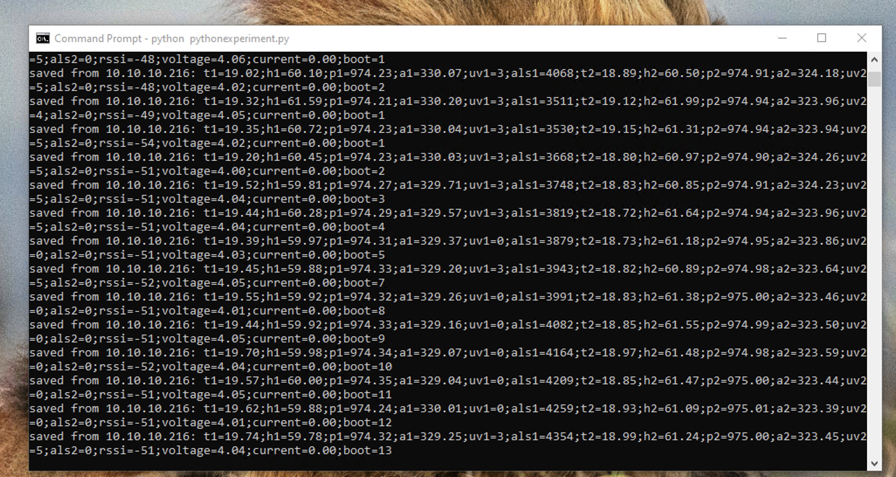

# Meteostanice

> Plán a stav projektu: [TODO.md](TODO.md)

ESP32-S3 weather station that wakes every 60 s, reads sensors, and POSTs the data over Wi-Fi to a local Python server that stores it in a CSV file.
In future to Home assistant.

## Hardware

- **MCU**: ESP32-S3-DevKitC-1
- **Sensors (2× independent I2C buses)**:
  - BME280 – temperature, humidity, pressure, altitude
  - LTR390 – UV index, ambient light
- **Power monitoring**: voltage divider on GPIO 7 — see [docs/voltage-measurement.md](docs/voltage-measurement.md); ACS712 current sensor wired to GPIO 5 (measurement currently disabled in firmware)
- **Sensor power switch**: GPIO 35, 4, 47 (powered off before deep sleep)

## Firmware ([src/main.cpp](src/main.cpp))

- Reads both sensor sets on startup
- Connects to Wi-Fi (uses RTC-cached BSSID/channel/IP for fast reconnect after deep sleep)
- POSTs a semicolon-delimited payload to `POST /ingest`
- Enters deep sleep for 60 s

### Payload format

```
t1=22.50;h1=55.10;p1=1012.30;a1=10.50;uv1=123;als1=456;t2=22.40;h2=54.80;p2=1012.25;a2=10.60;uv2=120;als2=450;rssi=-65;voltage=4.12;current=0.00;boot=42
```

## Server ([src/server/server.py](src/server/server.py))



Minimal Python HTTP server (no dependencies beyond stdlib).

```bash
python3 src/server/server.py
```

- Listens on `0.0.0.0:5000`
- `POST /ingest` – saves payload to `src/server/sensor_data.csv`
- `GET /health` – returns `ok`
- Automatically migrates CSV header if the schema changes

## Test environments

| PlatformIO env | Source file | Purpose |
|---|---|---|
| `main` | `src/main.cpp` | Full station firmware |
| `test-voltage` | `src/test_voltage.cpp` | Voltage divider calibration |
| `test-current` | `src/test_current.cpp` | ACS712 current sensor calibration |

## Build & flash

```bash
pio run -e main -t upload
pio device monitor
```
